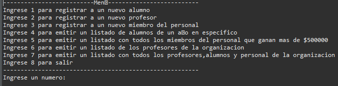
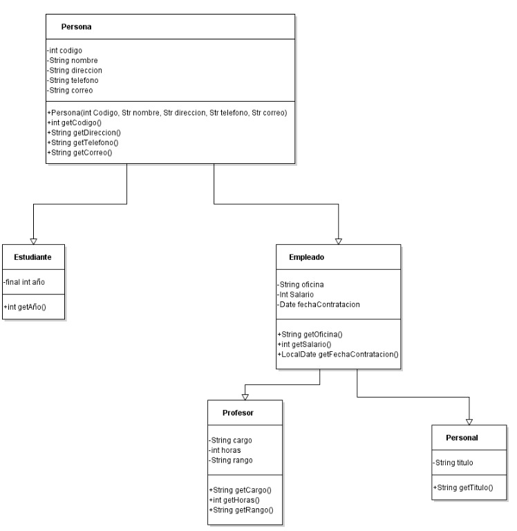

#java-personas-herencia

#UML

## Descripción 📑

[PDF Del Problema](assets/pdf/lab3CORREGIDO.pdf)

## ¿Qué he aprendido en este proyecto? 🙇🏻 

En este proyecto, he desarrollado un sistema de gestión para una institución educativa, lo que me ha permitido profundizar en varios conceptos clave de la programación orientada a objetos (POO) y el diseño de sistemas. Aquí destaco los principales aprendizajes:

Jerarquía de clases: He implementado una estructura jerárquica de clases que incluye una clase base Persona y sus subclases Estudiante y Empleado, con Empleado teniendo a su vez las subclases Profesor y Personal. Esto me ha ayudado a comprender mejor la herencia y cómo organizar entidades relacionadas en un sistema.

Modelado de datos: He aprendido a identificar y modelar atributos relevantes para cada clase, como código, nombre, dirección, etc., para Persona, y atributos específicos para cada subclase (por ejemplo, estado para Estudiante, salario para Empleado).

Uso de constantes: He utilizado constantes para representar el estado de los estudiantes, lo que me ha enseñado cómo manejar valores fijos y mejorar la legibilidad del código.
Manejo de fechas: He trabajado con la clase Date para manejar las fechas de contratación de los empleados, lo que me ha permitido practicar el uso de objetos para representar información temporal.

Polimorfismo: Al sobrescribir el método toString() en cada clase, he aplicado el concepto de polimorfismo, permitiendo que cada objeto se represente de manera única.

Diseño UML: He creado un diagrama UML para visualizar la estructura de clases, lo que me ha ayudado a comprender mejor las relaciones entre las diferentes entidades del sistema.

Interfaz de usuario: He implementado un menú interactivo que permite crear diferentes tipos de objetos (Alumno, Profesor, Personal) y generar listados específicos, lo que me ha dado experiencia en la creación de interfaces de usuario básicas y en el manejo de la interacción con el usuario.

Manejo de colecciones: Para generar los diferentes listados requeridos, he practicado el uso de estructuras de datos y métodos de filtrado para manipular colecciones de objetos.

Encapsulamiento: Al definir atributos y métodos para cada clase, he aplicado el principio de encapsulamiento, ocultando los detalles de implementación y exponiendo solo lo necesario.

Validación de datos: He implementado validaciones básicas, como asegurar que el código de persona sea un número entero de cuatro dígitos, lo que me ha enseñado la importancia de la integridad de los datos en un sistema.

Este proyecto me ha proporcionado una valiosa experiencia práctica en el diseño e implementación de sistemas orientados a objetos, mejorando mis habilidades de programación y mi comprensión de los principios fundamentales de la POO.

## Tecnologías 🛠
<!-- Iconos sacados de: https://github.com/hendrasob/badges/blob/master/README.md y https://github.com/alexandresanlim/Badges4-README.md-Profile -->

## Autor ✒️
**Kamikazejar**

* <a href="https://www.linkedin.com/in/rodrigocarmonah/" target="_blank">LinkedIn</a>
* <a href="https://rodrigocarmonaherrera.com/" target="_blank">Portafolio Web</a>
* [Email](mailto:rcarmonah@outlook.com)

  
## Instalación 
Para compilar y ejecutar este proyecto Java, necesitarás un compilador Java. Si aún no tienes uno, puedes instalar el [JDK (Java Development Kit)](https://www.oracle.com/java/technologies/javase-downloads.html).
Se recomienda abir en un editor como ECLIPSE, APACHE NET BEANS O IntelliJ IDEA *Nota al exportar vea que sus preferiencias sean UTF-8(para no tener problemas con las Ñ o "tildes")
  
## Licencia 📄
MIT Public License v3.0
No puede usarse comencialmente.
